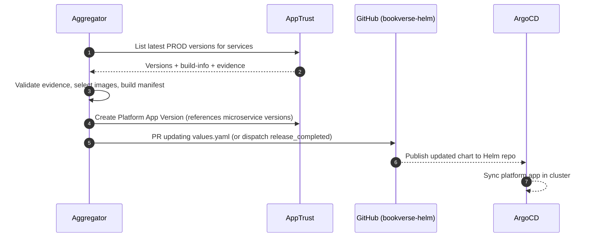

# BookVerse Platform Service — Plan of Action

## Goals

- Provide an automated aggregator that composes a single "platform" release from independently promoted microservice releases.
- Create and maintain a Platform Application Version in AppTrust that references specific microservice versions and images.
- Pin microservice image coordinates (tags and/or digests) into the platform Helm chart values and trigger GitOps syncs.
- Be deterministic, idempotent, observable, and safe to run on a schedule, via webhook, or on-demand.

## Non-Goals

- Orchestrating microservice promotions themselves (each service handles its own CI/CD and promotion).
- Heavy dependency resolution or semantic compatibility modeling beyond simple rules (initially latest PROD only).

## High-Level Architecture

- Components
  - Aggregator CLI/Worker (Python) packaged as a container image.
  - AppTrust Client: reads microservice application versions and evidence.
  - Manifest Builder: writes a Platform Release Manifest (YAML) with exact image references and provenance.
  - Publisher: updates Helm chart values (in `bookverse-helm/charts/platform`) via GitHub PR or repository_dispatch.
  - Webhook/Trigger Adapter (optional): receives events from AppTrust/CI to kick off aggregation.
- External Systems
  - JFrog AppTrust & Artifactory APIs.
  - GitHub API (PRs, commits, workflow dispatch).
  - ArgoCD (GitOps) consumes chart updates from `bookverse-helm` published to JFrog Helm repo.
- Runtime Modes
  - Scheduled: cron (e.g., bi-weekly) to produce a regular platform cut.
  - Event-driven: on microservice promotion to PROD or manual dispatch.
  - Dry-run: compute results, print manifest diff, no writes.

## Inputs and Outputs

- Inputs
  - Configured list of microservices to aggregate (static configuration file, not runtime input): `inventory`, `recommendations`, `checkout`, `web`.
  - AppTrust application names per microservice.
  - Stage to source from: `PROD` only (global). QA/STAGING sourcing is intentionally out of scope for the demo.
  - Optional constraints: minimum required evidence (e.g., signatures present). SBOM evidence is automatic in AppTrust and not generated here.
- Outputs
  - Platform Release Manifest (YAML) written to this repo (`/manifests/`) and/or attached to AppTrust.
  - A new platform AppTrust Application Version that references exact microservice versions.
  - Updated Helm values in `bookverse-helm/charts/platform/values.yaml` with pinned image tags/digests.
  - GitHub PR (or direct commit in a bot branch) to carry the Helm changes.
  - Optional repository_dispatch to `bookverse-helm` to run auto-pin workflow.

## Data Model

### PlatformReleaseManifest (YAML)

```yaml
version: 2025.09.05.1
created_at: 2025-09-05T12:00:00Z
source_stage: PROD
microservices:
  inventory:
    apptrust_application: bookverse-inventory
    apptrust_version: 1.8.3
    image:
      registry: evidencetrial.jfrog.io
      repository: bookverse-inventory-internal-docker-release-local/inventory
      tag: 1.8.3
      digest: sha256:abc123...
  recommendations:
    apptrust_application: bookverse-recommendations
    apptrust_version: 0.9.0
    image:
      registry: evidencetrial.jfrog.io
      repository: bookverse-recommendations-internal-docker-release-local/recommendations-api
      tag: 0.9.0
      digest: sha256:def456...
  checkout:
    apptrust_application: bookverse-checkout
    apptrust_version: 0.7.2
    image:
      registry: evidencetrial.jfrog.io
      repository: bookverse-checkout-internal-docker-release-local/checkout-api
      tag: 0.7.2
      digest: sha256:ghi789...
  web:
    apptrust_application: bookverse-web
    apptrust_version: 0.4.1
    image:
      registry: evidencetrial.jfrog.io
      repository: bookverse-web-internal-docker-release-local/web
      tag: 0.4.1
      digest: sha256:jkl012...
provenance:
  evidence_minimums:
    sbom_present: true
    signatures_present: true
notes: 'Auto-generated by platform-aggregator'
```

### Helm values pinning (example)

```yaml
# bookverse-helm/charts/platform/values.yaml
imageTags:
  inventory: "1.8.3"
  recommendations: "0.9.0"
  checkout: "0.7.2"
  web: "0.4.1"
# Optional digests if chart supports digest-based pinning
imageDigests:
  inventory: "sha256:abc123..."
  recommendations: "sha256:def456..."
  checkout: "sha256:ghi789..."
  web: "sha256:jkl012..."
```

## Core Algorithm (Aggregation)

Live-only aggregator; default is write mode. `--preview` disables writes; `--override service=version` allows pinning a specific service version.

Pseudocode for building a platform cut:

```python
def aggregate_platform_release(stage: str = "PROD", constraints: Constraints) -> PlatformRelease:
    services = load_configured_services()

    components = []
    for service in services:
        app = apptrust.get_application(service.app_name)
        # Fetch latest version in the requested stage (e.g., PROD)
        v = apptrust.get_latest_version(app, stage)
        if not v:
            raise StageContentError(f"No version in stage {stage} for {service}")

        # Resolve container images from build-info bound to the version
        images = apptrust.get_images_for_version(v)
        selected = select_primary_image(images, service.image_selector)

        # Validate evidence (signatures) if required; SBOM is automatic in AppTrust
        evidence = apptrust.get_evidence(v)
        validate_evidence(evidence, constraints)

        components.append(Component(
            name=service.name,
            apptrust_version=v.version,
            image=selected,
            evidence=evidence.summary()
        ))

    # Determine platform version (CalVer YYYY.MM.DD[.N])
    platform_version = determine_calver(existing_versions())

    manifest = build_manifest(components, stage)
    apptrust.create_platform_version(platform_version, components)
    return PlatformRelease(noop=False, version=platform_version, manifest=manifest)
```

### Evidence Rules (initial)

- signatures_present: true → fail aggregation if missing.
- optional: minimum coverage or test evidence thresholds (informational for now).

## Workflow: From Aggregation to Deployment

1) Run aggregator
   - Manual trigger (default during development).
   - Scheduled run every two weeks on Monday (commented out by default; enable for demo cadence).
2) Read latest PROD versions for each microservice; validate evidence.
3) Create Platform Release Manifest and a Platform AppTrust Application Version.
4) Publish Helm updates
   - Open a PR in `bookverse-helm` updating `charts/platform/values.yaml` (single values file).
   - Or dispatch a `release_completed` repository_dispatch event that triggers the auto-pin workflow (PROD only) in `bookverse-helm` to apply the changes.
5) When PR merges or auto-pin commits, CI packages the Helm chart and pushes to JFrog Helm repo.
6) ArgoCD detects chart update and syncs.
7) Presenter can open the site, confirm versions via env banner and optional `/info` endpoints.

## Webhook-driven Helm Pinning (Planned)

- Trigger: AppTrust `release_completed` for `bookverse-platform` (release events are PROD by definition).
- JFrog Webhook:
  - Endpoint: `https://api.github.com/repos/yonatanp-jfrog/bookverse-helm/dispatches`
  - Method: `POST`
  - Headers:
    - `Authorization: Bearer <GitHub PAT with repo:write>`
    - `Accept: application/vnd.github+json`
    - `Content-Type: application/json`
  - Body template:

    ```json
    {
      "event_type": "release_completed",
      "client_payload": { "platform_version": "{{applicationVersion}}" }
    }
    ```

- Receiver: `bookverse-helm/.github/workflows/platform_release_handler.yml`
  - Resolves components from AppTrust for that platform version.
  - Pins `platform.version` and per-service `tag` in `charts/platform/values.yaml`.
  - Commits and packages the chart.
- Security: use a fine-grained Personal Access Token (PAT) limited to `bookverse-helm` with Contents: Read & Write (Option A for the demo). Future: GitHub App.
- PAT handling:
  - Create the PAT manually in GitHub (cannot be automated by script).
  - Scope: repository access only to `bookverse-helm`.
  - Permissions: Contents (Read and write). Add Actions (Read and write) only if required by the workflow.
  - Provide the PAT to the platform init process via environment variable and store it as a Kubernetes Secret for the `bookverse-platform` service.
  - The init script validates the PAT by attempting a `repository_dispatch` dry-run (expect HTTP 204).
- Manual dry-run: send the same `repository_dispatch` via curl to validate end-to-end before enabling webhook.

## Failure Modes and Idempotency

- Missing microservice version in stage: stop and emit actionable error (which service is missing in `PROD`).
- Evidence failure: stop and report which requirement failed.
- API rate/timeouts: retry with exponential backoff and jitter; per-call deadlines.
- Idempotent runs: if computed manifest matches the last successful platform version (by digests), skip creating a new version and skip Helm updates.
- Partial failures around Git operations: PR created but AppTrust version missing → bot closes PR on next run (reconciliation loop detects drift).

## Observability

- Structured logs for each step: discovery, evidence checks, selection, manifest hash, PR URL, AppTrust version.
- Metrics (if enabled): aggregation latency, failures, retries, no-op runs count.
- Tracing: propagate `traceparent` if called via webhook.

## Configuration

- Env Vars
  - `JFROG_URL`, `JFROG_ACCESS_TOKEN` or OIDC settings for CLI login.
  - `GITHUB_APP_ID`/`GITHUB_INSTALLATION_ID` or PAT (prefer GitHub App) for PRs.
  - `MICROSERVICES` (CSV or JSON): names and apptrust ids, image selectors.
  - `SOURCE_STAGE` (default `PROD`), `TARGET_BRANCH` (default `main`).
  - `HELM_REPO` information (org/repo for chart updates).
  - `EVIDENCE_MINIMUMS` (JSON) feature flag.
- Files
  - `/config/services.yaml` (checked-in): canonical list of services, selectors, repos.

## CI/CD for Platform Service

- CI pipeline:
  - lint/test → build container → publish to `bookverse-platform-docker-*` repos.
  - attach build-info; create AppTrust application version (for aggregator image) with evidence.
- Release workflow:
  - tag `vX.Y.Z` publishes to release repo.
  - Optional promote workflow to DEV→QA→STAGING→PROD for the aggregator itself.

## Security and Access

- Use GitHub OIDC to JFrog; no stored tokens.
- Use a GitHub App for repository writes (least privilege, bot identity).
- Store no secrets in the repo; rely on repo/environment variables.
- Read-only by default; require explicit `--write` for PR creation (dry-run default safe).

## Rollback Strategy

- If a platform version is found problematic, the operator manually triggers a rollback to a prior platform version.
- If the rolled-back version was the latest, subsequent released versions become the latest automatically; the aggregator will select the highest available prior good version on next run.

## Testing Strategy

- Simulated tests suitable for a demo: stubbed AppTrust and GitHub clients, golden manifests, and deterministic fixtures. No external systems required.

## Implementation TODO (Prioritized)

1) Bootstrap aggregator module and CLI entrypoint.
2) Implement AppTrust client: list applications, versions by stage, associated build-info/images, evidence.
3) Implement image selection rules and evidence validation.
4) Build Platform Release Manifest writer and hashing for idempotency.
5) Implement platform AppTrust version creation that references microservice versions.
6) Implement Helm publisher (PR flow) and alternative repository_dispatch.
7) Add dry-run and `--write` flags; structured logging; retries.
8) Wire CI (build/test/publish) and repository variables.
9) Add sample `/config/services.yaml` and example manifest.
10) Add optional webhook handler (FastAPI) for future event-driven runs.

## Sequence (Mermaid)


