# BookVerse Platform Service - Aggregation Patterns Guide

**Release coordination, version management, and dependency handling for BookVerse microservices platform**

The BookVerse Platform Service implements sophisticated aggregation patterns that coordinate releases across all microservices, manage platform-wide version dependencies, and orchestrate comprehensive platform releases with automated validation and rollback capabilities.

---

## 📋 Table of Contents

- [Aggregation Architecture](#-aggregation-architecture)
- [Release Coordination Patterns](#-release-coordination-patterns)
- [Version Management Strategy](#-version-management-strategy)
- [Dependency Resolution](#-dependency-resolution)
- [Service Compatibility Matrix](#-service-compatibility-matrix)
- [Platform Release Orchestration](#-platform-release-orchestration)
- [Automated Validation Framework](#-automated-validation-framework)
- [Rollback and Recovery Patterns](#-rollback-and-recovery-patterns)
- [Monitoring and Observability](#-monitoring-and-observability)
- [Troubleshooting Guide](#-troubleshooting-guide)

---

## 🏗️ Aggregation Architecture

### Platform Aggregation Overview

The BookVerse Platform Service serves as the central coordination point for all microservices, implementing a hub-and-spoke architecture for release management:

```mermaid
graph TB
    Platform[Platform Service<br/>🎯 Central Orchestrator] --> Inventory[Inventory Service<br/>📦 v1.2.3]
    Platform --> Recommendations[Recommendations Service<br/>🤖 v2.1.0]
    Platform --> Checkout[Checkout Service<br/>💳 v1.5.2]
    Platform --> Web[Web Application<br/>🌐 v3.0.1]
    Platform --> Helm[Helm Charts<br/>⎈ v1.1.0]
    
    Platform --> AppTrust[AppTrust Platform<br/>🏢 Version Registry]
    Platform --> JFrog[JFrog Artifactory<br/>📚 Artifact Storage]
    
    AppTrust --> PROD[PROD Environment<br/>🚀 Platform v2.1.0]
    AppTrust --> STAGING[STAGING Environment<br/>🧪 Platform v2.2.0-rc.1]
    AppTrust --> QA[QA Environment<br/>🔍 Platform v2.2.0-beta.3]
    AppTrust --> DEV[DEV Environment<br/>⚡ Platform v2.3.0-alpha.1]
```



### Core Aggregation Principles

1. **Semantic Version Coordination**: All services follow SemVer 2.0 with coordinated major/minor releases
2. **Dependency Graph Management**: Platform maintains complete dependency graph and compatibility matrix
3. **Release Train Model**: Bi-weekly platform releases with service-specific hotfixes
4. **Environment Progression**: Automated promotion through DEV → QA → STAGING → PROD lifecycle
5. **Rollback Safety**: Complete rollback capabilities at platform and service levels

### Aggregation Components

| Component | Purpose | Responsibility |
|-----------|---------|----------------|
| **Version Resolver** | Semantic version parsing and comparison | Determines compatible service versions |
| **Dependency Analyzer** | Service dependency graph construction | Maps inter-service dependencies |
| **Release Coordinator** | Platform release orchestration | Coordinates multi-service releases |
| **Compatibility Checker** | Service compatibility validation | Ensures service version compatibility |
| **AppTrust Integration** | Version registry management | Manages platform versions in AppTrust |

---

## 🔄 Release Coordination Patterns

### Synchronized Release Pattern

The Platform Service implements synchronized releases for coordinated feature deployments:

```python
# Platform Release Coordination
class PlatformReleaseCoordinator:
    def __init__(self):
        self.services = [
            'bookverse-inventory',
            'bookverse-recommendations', 
            'bookverse-checkout',
            'bookverse-web',
            'bookverse-helm'
        ]
        self.apptrust_client = AppTrustClient()
        
    async def coordinate_platform_release(self, target_version):
        """
        Coordinate synchronized release across all services.
        
        This method orchestrates a platform-wide release by:
        1. Collecting service versions for compatibility analysis
        2. Validating inter-service dependencies
        3. Creating platform release manifest
        4. Orchestrating service promotions
        5. Validating platform integrity
        """
        
        # Phase 1: Version Collection and Validation
        service_versions = await self.collect_service_versions()
        compatibility_matrix = await self.validate_compatibility(service_versions)
        
        if not compatibility_matrix.is_compatible:
            raise IncompatibleServicesError(compatibility_matrix.conflicts)
        
        # Phase 2: Platform Release Manifest Creation
        platform_manifest = PlatformManifest(
            version=target_version,
            services=service_versions,
            dependencies=compatibility_matrix.dependencies,
            timestamp=datetime.utcnow(),
            release_notes=await self.generate_release_notes(service_versions)
        )
        
        # Phase 3: AppTrust Platform Version Creation
        platform_version_id = await self.apptrust_client.create_platform_version(
            version=target_version,
            manifest=platform_manifest.to_dict()
        )
        
        # Phase 4: Service Promotion Orchestration
        promotion_results = await self.orchestrate_service_promotions(
            service_versions, 
            target_stage='STAGING'
        )
        
        # Phase 5: Platform Validation
        validation_result = await self.validate_platform_integrity(
            platform_version_id,
            promotion_results
        )
        
        if validation_result.success:
            return PlatformReleaseResult(
                version=target_version,
                platform_version_id=platform_version_id,
                service_promotions=promotion_results,
                validation=validation_result
            )
        else:
            # Rollback on validation failure
            await self.rollback_platform_release(platform_version_id, promotion_results)
            raise PlatformValidationError(validation_result.errors)
```

### Independent Service Release Pattern

For hotfixes and service-specific updates that don't require platform coordination:

```python
class IndependentServiceReleaseManager:
    async def coordinate_service_release(self, service_name, service_version):
        """
        Coordinate independent service release with platform compatibility checks.
        
        This method handles service-specific releases by:
        1. Validating backward compatibility with current platform version
        2. Checking dependency constraints
        3. Performing isolated service validation
        4. Updating platform compatibility matrix
        """
        
        # Get current platform version
        current_platform = await self.get_current_platform_version()
        
        # Validate service compatibility
        compatibility_check = await self.check_service_compatibility(
            service_name=service_name,
            service_version=service_version,
            platform_version=current_platform.version
        )
        
        if not compatibility_check.is_compatible:
            raise ServiceIncompatibilityError(
                f"Service {service_name} v{service_version} is incompatible with "
                f"platform v{current_platform.version}: {compatibility_check.reason}"
            )
        
        # Perform service-specific validation
        validation_result = await self.validate_service_independently(
            service_name, 
            service_version
        )
        
        if validation_result.success:
            # Update platform compatibility matrix
            await self.update_compatibility_matrix(
                service_name,
                service_version,
                current_platform.version
            )
            
            return ServiceReleaseResult(
                service=service_name,
                version=service_version,
                platform_version=current_platform.version,
                compatibility=compatibility_check,
                validation=validation_result
            )
        else:
            raise ServiceValidationError(validation_result.errors)
```

---

## 📊 Version Management Strategy

### Semantic Versioning Coordination

The Platform Service implements sophisticated semantic version management:

```python
class PlatformVersionManager:
    def __init__(self):
        self.version_parser = SemVerParser()
        self.compatibility_rules = CompatibilityRules()
        
    def determine_platform_version(self, service_versions):
        """
        Determine platform version based on constituent service versions.
        
        Platform versioning rules:
        - MAJOR: Any service has MAJOR version bump
        - MINOR: Any service has MINOR version bump (no MAJOR bumps)
        - PATCH: Only PATCH version bumps across all services
        """
        
        version_changes = []
        current_platform = self.get_current_platform_version()
        
        for service, new_version in service_versions.items():
            current_service_version = self.get_current_service_version(service)
            
            change_type = self.analyze_version_change(
                current_service_version,
                new_version
            )
            
            version_changes.append({
                'service': service,
                'change_type': change_type,
                'from_version': current_service_version,
                'to_version': new_version
            })
        
        # Determine platform version bump based on highest impact change
        if any(change['change_type'] == 'MAJOR' for change in version_changes):
            new_platform_version = self.bump_major_version(current_platform)
        elif any(change['change_type'] == 'MINOR' for change in version_changes):
            new_platform_version = self.bump_minor_version(current_platform)
        else:
            new_platform_version = self.bump_patch_version(current_platform)
        
        return PlatformVersionDetermination(
            platform_version=new_platform_version,
            service_changes=version_changes,
            rationale=self.generate_version_rationale(version_changes)
        )
    
    def analyze_version_change(self, current_version, new_version):
        """Analyze the type of version change between two semantic versions."""
        current = self.version_parser.parse(current_version)
        new = self.version_parser.parse(new_version)
        
        if new.major > current.major:
            return 'MAJOR'
        elif new.minor > current.minor:
            return 'MINOR'
        elif new.patch > current.patch:
            return 'PATCH'
        else:
            return 'NONE'
```

### Version Compatibility Matrix

```python
class CompatibilityMatrix:
    def __init__(self):
        self.compatibility_rules = {
            # Service-to-service compatibility rules
            'inventory': {
                'recommendations': self.inventory_recommendations_compatibility,
                'checkout': self.inventory_checkout_compatibility,
                'web': self.inventory_web_compatibility
            },
            'recommendations': {
                'web': self.recommendations_web_compatibility
            },
            'checkout': {
                'web': self.checkout_web_compatibility,
                'inventory': self.checkout_inventory_compatibility
            }
        }
    
    def validate_service_compatibility(self, service_versions):
        """
        Validate compatibility between all service versions.
        
        Returns comprehensive compatibility analysis including:
        - Compatible service pairs
        - Incompatible service pairs with reasons
        - Compatibility warnings for version mismatches
        - Recommended version upgrades
        """
        
        compatibility_results = []
        
        for service_a, version_a in service_versions.items():
            for service_b, version_b in service_versions.items():
                if service_a != service_b and service_a in self.compatibility_rules:
                    if service_b in self.compatibility_rules[service_a]:
                        compatibility_func = self.compatibility_rules[service_a][service_b]
                        
                        result = compatibility_func(version_a, version_b)
                        compatibility_results.append({
                            'service_a': service_a,
                            'version_a': version_a,
                            'service_b': service_b,
                            'version_b': version_b,
                            'compatible': result.compatible,
                            'reason': result.reason,
                            'severity': result.severity
                        })
        
        return CompatibilityAnalysis(
            results=compatibility_results,
            overall_compatible=all(r['compatible'] for r in compatibility_results),
            warnings=[r for r in compatibility_results if r['severity'] == 'WARNING'],
            errors=[r for r in compatibility_results if r['severity'] == 'ERROR']
        )
    
    def inventory_recommendations_compatibility(self, inventory_version, recommendations_version):
        """Check compatibility between Inventory and Recommendations services."""
        inventory = SemVer.parse(inventory_version)
        recommendations = SemVer.parse(recommendations_version)
        
        # Recommendations service requires Inventory API v1.x.x
        if inventory.major == 1 and recommendations.major <= 2:
            return CompatibilityResult(
                compatible=True,
                reason="Inventory v1.x.x API is compatible with Recommendations v2.x.x",
                severity="OK"
            )
        else:
            return CompatibilityResult(
                compatible=False,
                reason=f"Inventory v{inventory_version} API changes break Recommendations v{recommendations_version}",
                severity="ERROR"
            )
```

---

## 🔗 Dependency Resolution

### Service Dependency Graph

```python
class ServiceDependencyResolver:
    def __init__(self):
        self.dependency_graph = {
            'bookverse-web': {
                'depends_on': [
                    'bookverse-inventory',
                    'bookverse-recommendations', 
                    'bookverse-checkout',
                    'bookverse-platform'
                ],
                'api_contracts': {
                    'inventory': ['GET /books', 'GET /books/{id}', 'GET /inventory/{id}'],
                    'recommendations': ['POST /recommendations'],
                    'checkout': ['POST /orders', 'GET /orders/{id}'],
                    'platform': ['GET /version', 'GET /health']
                }
            },
            'bookverse-checkout': {
                'depends_on': ['bookverse-inventory'],
                'api_contracts': {
                    'inventory': ['GET /inventory/{id}', 'POST /inventory/{id}/adjust']
                }
            },
            'bookverse-recommendations': {
                'depends_on': ['bookverse-inventory'],
                'api_contracts': {
                    'inventory': ['GET /books', 'GET /books/{id}']
                }
            },
            'bookverse-helm': {
                'depends_on': [
                    'bookverse-inventory',
                    'bookverse-recommendations',
                    'bookverse-checkout',
                    'bookverse-web',
                    'bookverse-platform'
                ],
                'deployment_contracts': {
                    'all_services': ['health_check', 'readiness_probe', 'liveness_probe']
                }
            }
        }
    
    def resolve_deployment_order(self, service_versions):
        """
        Resolve optimal deployment order based on dependency graph.
        
        Returns topologically sorted deployment order ensuring:
        1. Dependencies are deployed before dependents
        2. Parallel deployment of independent services
        3. Rollback order (reverse of deployment order)
        """
        
        # Build directed graph
        graph = defaultdict(list)
        in_degree = defaultdict(int)
        
        for service in service_versions.keys():
            if service not in in_degree:
                in_degree[service] = 0
                
        for service, config in self.dependency_graph.items():
            if service in service_versions:
                for dependency in config.get('depends_on', []):
                    if dependency in service_versions:
                        graph[dependency].append(service)
                        in_degree[service] += 1
        
        # Topological sort with Kahn's algorithm
        deployment_phases = []
        queue = deque([service for service in service_versions.keys() if in_degree[service] == 0])
        
        while queue:
            # Services that can be deployed in parallel
            current_phase = list(queue)
            deployment_phases.append(current_phase)
            queue.clear()
            
            # Update in-degrees for next phase
            for service in current_phase:
                for dependent in graph[service]:
                    in_degree[dependent] -= 1
                    if in_degree[dependent] == 0:
                        queue.append(dependent)
        
        return DeploymentPlan(
            phases=deployment_phases,
            rollback_order=list(reversed([service for phase in deployment_phases for service in phase])),
            parallel_groups=len(deployment_phases)
        )
    
    def validate_api_contracts(self, service_versions):
        """
        Validate that all API contracts are satisfied by service versions.
        
        Checks:
        1. Required endpoints are available
        2. API version compatibility
        3. Schema compatibility for request/response formats
        """
        
        validation_results = []
        
        for service, config in self.dependency_graph.items():
            if service in service_versions:
                for dependency, contracts in config.get('api_contracts', {}).items():
                    if dependency in service_versions:
                        for contract in contracts:
                            validation_result = self.validate_single_contract(
                                consumer=service,
                                consumer_version=service_versions[service],
                                provider=dependency,
                                provider_version=service_versions[dependency],
                                contract=contract
                            )
                            validation_results.append(validation_result)
        
        return APIContractValidation(
            results=validation_results,
            all_contracts_valid=all(r.valid for r in validation_results),
            contract_violations=[r for r in validation_results if not r.valid]
        )
```

---

## 📈 Service Compatibility Matrix

### Version Compatibility Database

```python
class CompatibilityDatabase:
    def __init__(self):
        # Known compatible version combinations
        self.compatibility_matrix = {
            'platform_versions': {
                '2.1.0': {
                    'inventory': ['1.2.3', '1.2.4', '1.3.0'],
                    'recommendations': ['2.1.0', '2.1.1'],
                    'checkout': ['1.5.2', '1.5.3'],
                    'web': ['3.0.1', '3.0.2'],
                    'helm': ['1.1.0']
                },
                '2.0.0': {
                    'inventory': ['1.2.0', '1.2.1', '1.2.2'],
                    'recommendations': ['2.0.0', '2.0.1'],
                    'checkout': ['1.5.0', '1.5.1'],
                    'web': ['3.0.0'],
                    'helm': ['1.0.0', '1.0.1']
                }
            },
            'api_compatibility': {
                'inventory': {
                    'v1': {
                        'endpoints': [
                            {'path': '/books', 'methods': ['GET'], 'stable_since': '1.0.0'},
                            {'path': '/books/{id}', 'methods': ['GET'], 'stable_since': '1.0.0'},
                            {'path': '/inventory/{id}', 'methods': ['GET', 'POST'], 'stable_since': '1.1.0'}
                        ],
                        'breaking_changes': {
                            '2.0.0': ['Removed deprecated /books/search endpoint']
                        }
                    }
                }
            }
        }
    
    def check_platform_compatibility(self, target_platform_version, service_versions):
        """Check if service versions are compatible with target platform version."""
        
        if target_platform_version not in self.compatibility_matrix['platform_versions']:
            return self.infer_compatibility(target_platform_version, service_versions)
        
        compatible_versions = self.compatibility_matrix['platform_versions'][target_platform_version]
        compatibility_results = {}
        
        for service, version in service_versions.items():
            if service in compatible_versions:
                compatible_versions_list = compatible_versions[service]
                is_compatible = version in compatible_versions_list
                
                compatibility_results[service] = {
                    'compatible': is_compatible,
                    'current_version': version,
                    'compatible_versions': compatible_versions_list,
                    'recommendation': self.get_version_recommendation(service, version, compatible_versions_list)
                }
            else:
                compatibility_results[service] = {
                    'compatible': False,
                    'reason': f'Service {service} not supported in platform {target_platform_version}'
                }
        
        return PlatformCompatibilityResult(
            platform_version=target_platform_version,
            service_compatibility=compatibility_results,
            overall_compatible=all(r.get('compatible', False) for r in compatibility_results.values())
        )
```

---

## 🚀 Platform Release Orchestration

### Bi-Weekly Release Train

```python
class PlatformReleaseTrain:
    def __init__(self):
        self.release_schedule = BiWeeklySchedule()
        self.release_manager = PlatformReleaseManager()
        
    async def execute_release_train(self, release_date):
        """
        Execute bi-weekly platform release train.
        
        Release train process:
        1. Service version collection and analysis
        2. Platform version determination
        3. Compatibility validation
        4. Release branch creation
        5. Automated testing and validation
        6. Stage-by-stage promotion
        7. Production deployment
        8. Post-release monitoring
        """
        
        release_context = ReleaseContext(
            release_date=release_date,
            release_type='SCHEDULED',
            release_train_version=self.determine_release_train_version(release_date)
        )
        
        try:
            # Phase 1: Pre-Release Preparation
            logger.info(f"Starting release train for {release_context.release_train_version}")
            
            service_versions = await self.collect_service_versions_for_release()
            platform_version = self.determine_platform_version(service_versions)
            
            # Phase 2: Compatibility and Validation
            compatibility_result = await self.validate_platform_compatibility(
                platform_version, 
                service_versions
            )
            
            if not compatibility_result.compatible:
                raise ReleaseTrainValidationError(
                    f"Compatibility validation failed: {compatibility_result.issues}"
                )
            
            # Phase 3: Release Branch and Build
            release_branch = await self.create_release_branch(
                platform_version,
                service_versions
            )
            
            build_results = await self.execute_platform_build(
                release_branch,
                service_versions
            )
            
            # Phase 4: Automated Testing
            test_results = await self.execute_comprehensive_testing(
                platform_version,
                build_results
            )
            
            if not test_results.all_passed:
                raise ReleaseTrainTestFailure(
                    f"Automated tests failed: {test_results.failures}"
                )
            
            # Phase 5: Stage Promotion
            promotion_results = await self.execute_stage_promotions(
                platform_version,
                service_versions,
                target_stages=['DEV', 'QA', 'STAGING']
            )
            
            # Phase 6: Production Deployment
            production_result = await self.deploy_to_production(
                platform_version,
                service_versions,
                promotion_results
            )
            
            # Phase 7: Post-Release Monitoring
            monitoring_setup = await self.setup_post_release_monitoring(
                platform_version,
                production_result
            )
            
            return ReleaseTrainResult(
                platform_version=platform_version,
                service_versions=service_versions,
                compatibility=compatibility_result,
                test_results=test_results,
                promotion_results=promotion_results,
                production_deployment=production_result,
                monitoring=monitoring_setup,
                success=True
            )
            
        except Exception as error:
            logger.error(f"Release train failed: {error}")
            
            # Execute rollback procedures
            await self.execute_release_train_rollback(
                release_context,
                error,
                locals()  # Capture current state for rollback
            )
            
            raise ReleaseTrainError(
                f"Release train {release_context.release_train_version} failed: {error}"
            ) from error
```

### Hotfix Release Pattern

```python
class HotfixReleaseManager:
    async def execute_hotfix_release(self, service_name, hotfix_version, urgency='HIGH'):
        """
        Execute emergency hotfix release for critical issues.
        
        Hotfix process:
        1. Rapid compatibility validation
        2. Expedited testing (subset of full test suite)
        3. Direct promotion to production-ready stages
        4. Accelerated deployment with monitoring
        """
        
        hotfix_context = HotfixContext(
            service=service_name,
            version=hotfix_version,
            urgency=urgency,
            initiated_at=datetime.utcnow()
        )
        
        # Rapid compatibility check
        current_platform = await self.get_current_platform_version()
        compatibility_check = await self.validate_hotfix_compatibility(
            service_name,
            hotfix_version,
            current_platform
        )
        
        if not compatibility_check.compatible:
            raise HotfixIncompatibilityError(
                f"Hotfix {service_name} v{hotfix_version} incompatible with platform v{current_platform.version}"
            )
        
        # Expedited testing based on urgency
        test_suite = self.select_test_suite_for_urgency(urgency)
        test_results = await self.execute_expedited_testing(
            service_name,
            hotfix_version,
            test_suite
        )
        
        if urgency == 'CRITICAL' and test_results.critical_tests_passed:
            # Skip non-critical tests for CRITICAL hotfixes
            logger.warning(f"Proceeding with CRITICAL hotfix despite {test_results.skipped_tests} skipped tests")
        elif not test_results.all_passed:
            raise HotfixTestFailure(f"Hotfix testing failed: {test_results.failures}")
        
        # Accelerated promotion to production-ready stages
        promotion_targets = self.determine_hotfix_promotion_targets(urgency)
        promotion_results = await self.execute_hotfix_promotions(
            service_name,
            hotfix_version,
            promotion_targets
        )
        
        # Production deployment with enhanced monitoring
        production_deployment = await self.deploy_hotfix_to_production(
            service_name,
            hotfix_version,
            enhanced_monitoring=True
        )
        
        return HotfixReleaseResult(
            service=service_name,
            version=hotfix_version,
            urgency=urgency,
            compatibility=compatibility_check,
            test_results=test_results,
            promotion_results=promotion_results,
            production_deployment=production_deployment,
            total_time=datetime.utcnow() - hotfix_context.initiated_at
        )
```

---

## ✅ Automated Validation Framework

### Platform Integration Testing

```python
class PlatformIntegrationValidator:
    def __init__(self):
        self.test_scenarios = [
            'end_to_end_user_journey',
            'service_integration_health',
            'performance_benchmarks',
            'security_validation',
            'data_consistency_checks'
        ]
    
    async def validate_platform_integration(self, platform_version, service_versions):
        """
        Execute comprehensive platform integration validation.
        
        Validation includes:
        1. End-to-end user journey testing
        2. Inter-service communication validation
        3. Performance benchmarking
        4. Security and compliance checks
        5. Data consistency validation
        """
        
        validation_results = {}
        
        for scenario in self.test_scenarios:
            try:
                scenario_result = await self.execute_validation_scenario(
                    scenario,
                    platform_version,
                    service_versions
                )
                validation_results[scenario] = scenario_result
                
            except Exception as error:
                validation_results[scenario] = ValidationScenarioResult(
                    scenario=scenario,
                    success=False,
                    error=str(error),
                    duration=0
                )
        
        overall_success = all(result.success for result in validation_results.values())
        
        return PlatformValidationResult(
            platform_version=platform_version,
            service_versions=service_versions,
            scenario_results=validation_results,
            overall_success=overall_success,
            validation_summary=self.generate_validation_summary(validation_results)
        )
    
    async def execute_end_to_end_user_journey(self, platform_version, service_versions):
        """Execute complete user journey across all services."""
        
        test_user = TestUser(id="test-user-platform-validation")
        journey_steps = []
        
        try:
            # Step 1: Browse books (Inventory Service)
            books_response = await self.call_service_endpoint(
                'inventory', 
                '/books', 
                expected_status=200
            )
            journey_steps.append(('browse_books', True, len(books_response['books'])))
            
            # Step 2: Get recommendations (Recommendations Service)
            recommendations_response = await self.call_service_endpoint(
                'recommendations',
                '/recommendations',
                method='POST',
                data={'user_id': test_user.id},
                expected_status=200
            )
            journey_steps.append(('get_recommendations', True, len(recommendations_response['recommendations'])))
            
            # Step 3: Add items to cart and checkout (Checkout Service)
            order_data = {
                'userId': test_user.id,
                'items': [
                    {'bookId': books_response['books'][0]['id'], 'qty': 1, 'unitPrice': 19.99}
                ]
            }
            
            order_response = await self.call_service_endpoint(
                'checkout',
                '/orders',
                method='POST',
                data=order_data,
                headers={'Idempotency-Key': f'test-{platform_version}-{int(time.time())}'},
                expected_status=201
            )
            journey_steps.append(('create_order', True, order_response['id']))
            
            # Step 4: Verify platform health (Platform Service)
            health_response = await self.call_service_endpoint(
                'platform',
                '/health',
                expected_status=200
            )
            journey_steps.append(('platform_health', True, health_response['status']))
            
            return EndToEndJourneyResult(
                success=True,
                steps=journey_steps,
                total_steps=len(journey_steps),
                successful_steps=sum(1 for _, success, _ in journey_steps if success)
            )
            
        except Exception as error:
            return EndToEndJourneyResult(
                success=False,
                steps=journey_steps,
                error=str(error),
                failed_at_step=len(journey_steps)
            )
```

---

## 🔄 Rollback and Recovery Patterns

### Platform Rollback Orchestration

```python
class PlatformRollbackOrchestrator:
    async def execute_platform_rollback(self, target_platform_version, rollback_reason):
        """
        Execute comprehensive platform rollback to known-good state.
        
        Rollback process:
        1. Identify target platform version and service versions
        2. Validate rollback target compatibility
        3. Execute service rollbacks in reverse dependency order
        4. Validate post-rollback platform integrity
        5. Update monitoring and alerting
        """
        
        rollback_context = RollbackContext(
            target_platform_version=target_platform_version,
            reason=rollback_reason,
            initiated_at=datetime.utcnow(),
            initiated_by=self.get_current_user()
        )
        
        try:
            # Phase 1: Rollback Planning
            rollback_plan = await self.create_rollback_plan(target_platform_version)
            
            if not rollback_plan.is_valid:
                raise RollbackPlanningError(
                    f"Cannot create valid rollback plan: {rollback_plan.errors}"
                )
            
            # Phase 2: Pre-Rollback Validation
            pre_rollback_state = await self.capture_current_state()
            rollback_safety_check = await self.validate_rollback_safety(
                rollback_plan,
                pre_rollback_state
            )
            
            if not rollback_safety_check.safe:
                raise RollbackSafetyError(
                    f"Rollback deemed unsafe: {rollback_safety_check.risks}"
                )
            
            # Phase 3: Service Rollback Execution
            service_rollback_results = []
            
            for service in rollback_plan.rollback_order:
                service_rollback_result = await self.rollback_service(
                    service_name=service.name,
                    target_version=service.target_version,
                    rollback_context=rollback_context
                )
                
                service_rollback_results.append(service_rollback_result)
                
                if not service_rollback_result.success:
                    # Partial rollback failure - attempt recovery
                    recovery_result = await self.attempt_service_rollback_recovery(
                        service,
                        service_rollback_result.error
                    )
                    
                    if not recovery_result.success:
                        raise ServiceRollbackError(
                            f"Failed to rollback {service.name}: {service_rollback_result.error}"
                        )
            
            # Phase 4: Platform Integrity Validation
            post_rollback_validation = await self.validate_post_rollback_integrity(
                target_platform_version,
                rollback_plan.target_service_versions
            )
            
            if not post_rollback_validation.success:
                raise PostRollbackValidationError(
                    f"Platform integrity validation failed after rollback: {post_rollback_validation.errors}"
                )
            
            # Phase 5: Monitoring and Alerting Updates
            await self.update_monitoring_after_rollback(
                target_platform_version,
                rollback_context
            )
            
            return PlatformRollbackResult(
                target_platform_version=target_platform_version,
                rollback_context=rollback_context,
                rollback_plan=rollback_plan,
                service_rollback_results=service_rollback_results,
                post_rollback_validation=post_rollback_validation,
                total_duration=datetime.utcnow() - rollback_context.initiated_at,
                success=True
            )
            
        except Exception as error:
            # Rollback failed - attempt emergency recovery
            emergency_recovery_result = await self.execute_emergency_recovery(
                rollback_context,
                error,
                pre_rollback_state
            )
            
            raise PlatformRollbackError(
                f"Platform rollback failed: {error}. Emergency recovery: {emergency_recovery_result.status}"
            ) from error
```

---

## 📊 Monitoring and Observability

### Platform Health Monitoring

```python
class PlatformHealthMonitor:
    def __init__(self):
        self.health_checks = [
            'service_health_check',
            'inter_service_connectivity',
            'database_connectivity',
            'external_dependency_health',
            'performance_metrics'
        ]
    
    async def monitor_platform_health(self):
        """
        Continuous platform health monitoring with aggregated reporting.
        
        Monitors:
        1. Individual service health status
        2. Inter-service communication health
        3. Database and external dependency connectivity
        4. Performance metrics and SLA compliance
        5. Security and compliance status
        """
        
        health_results = {}
        
        for check in self.health_checks:
            try:
                check_result = await self.execute_health_check(check)
                health_results[check] = check_result
            except Exception as error:
                health_results[check] = HealthCheckResult(
                    check_name=check,
                    status='FAILED',
                    error=str(error),
                    timestamp=datetime.utcnow()
                )
        
        # Aggregate platform health status
        platform_status = self.determine_platform_status(health_results)
        
        # Generate health report
        health_report = PlatformHealthReport(
            timestamp=datetime.utcnow(),
            platform_status=platform_status,
            individual_checks=health_results,
            platform_version=await self.get_current_platform_version(),
            service_versions=await self.get_current_service_versions()
        )
        
        # Send alerts if unhealthy
        if platform_status != 'HEALTHY':
            await self.send_platform_health_alert(health_report)
        
        return health_report
```

---

## 🔧 Troubleshooting Guide

### Common Aggregation Issues

#### 1. **Service Version Incompatibility**

**Problem**: Services fail compatibility validation during platform release.

**Diagnosis**:
```python
# Check compatibility matrix
compatibility_result = platform_service.validate_service_compatibility({
    'inventory': '1.3.0',
    'recommendations': '2.2.0',  # Incompatible version
    'checkout': '1.5.2'
})

print(compatibility_result.errors)
# Output: ['Recommendations v2.2.0 requires Inventory v1.4.0+ for new recommendation API']
```

**Resolution**:
1. Update incompatible services to compatible versions
2. Implement API versioning for backward compatibility
3. Use feature flags to enable/disable new functionality

#### 2. **Platform Release Validation Failures**

**Problem**: Platform integration tests fail during release validation.

**Diagnosis**:
```python
# Run specific validation scenario
validation_result = await platform_validator.execute_validation_scenario(
    'end_to_end_user_journey',
    platform_version='2.2.0',
    service_versions=proposed_versions
)

print(validation_result.failure_details)
```

**Resolution**:
1. Review service logs for integration issues
2. Validate API contract compliance
3. Check for race conditions in service startup order

#### 3. **Dependency Resolution Conflicts**

**Problem**: Circular dependencies or unresolvable dependency conflicts.

**Diagnosis**:
```python
# Analyze dependency graph
dependency_analysis = dependency_resolver.analyze_dependencies(service_versions)
print(dependency_analysis.circular_dependencies)
print(dependency_analysis.unresolvable_conflicts)
```

**Resolution**:
1. Refactor services to eliminate circular dependencies
2. Implement dependency injection patterns
3. Use event-driven architecture to decouple services

---

## 🚀 Next Steps

With platform aggregation patterns implemented, you can:

1. **Implement Custom Release Patterns**: Create domain-specific release coordination
2. **Enhance Compatibility Validation**: Add API contract testing and schema validation
3. **Optimize Release Performance**: Implement parallel deployment strategies
4. **Expand Monitoring**: Add business metrics and SLA monitoring
5. **Automate Remediation**: Implement self-healing platform capabilities

For additional information, see:
- [Release Management Guide](RELEASE_MANAGEMENT.md) - Detailed release procedures
- [Platform Architecture](../../docs/ARCHITECTURE.md) - Overall platform design
- [AppTrust Lifecycle Guide](../../bookverse-demo-init/docs/APPTRUST_LIFECYCLE.md) - Version management

---

*This aggregation patterns guide provides comprehensive coordination strategies for managing complex microservices platforms with enterprise-grade reliability and automated validation.*
