# BookVerse Platform Service - Release Management Guide

**Platform release workflows, bi-weekly aggregation, and hotfix procedures for enterprise-grade release coordination**

The BookVerse Platform Service implements comprehensive release management capabilities that orchestrate platform-wide releases, coordinate bi-weekly release trains, and manage emergency hotfix deployments across all BookVerse microservices with automated validation and rollback procedures.

---

## 📋 Table of Contents

- [Release Management Architecture](#-release-management-architecture)
- [Release Types and Strategies](#-release-types-and-strategies)
- [Bi-Weekly Release Train](#-bi-weekly-release-train)
- [Hotfix Release Procedures](#-hotfix-release-procedures)
- [Release Validation Framework](#-release-validation-framework)
- [Rollback and Recovery](#-rollback-and-recovery)
- [Release Monitoring](#-release-monitoring)
- [Process Automation](#-process-automation)
- [Compliance and Governance](#-compliance-and-governance)
- [Troubleshooting](#-troubleshooting)

---

## 🏗️ Release Management Architecture

### Release Orchestration Overview

The Platform Service coordinates all release activities across the BookVerse ecosystem using a sophisticated release management architecture:

```mermaid
graph TB
    RM[Release Manager<br/>🎯 Central Orchestrator] --> RO[Release Orchestrator<br/>📋 Workflow Engine]
    RM --> VM[Version Manager<br/>🔄 SemVer Coordination]
    RM --> VF[Validation Framework<br/>✅ Quality Gates]
    RM --> MM[Monitoring Manager<br/>📊 Release Tracking]
    
    RO --> BRT[Bi-Weekly Release Train<br/>🚂 Scheduled Releases]
    RO --> HRP[Hotfix Release Process<br/>🚨 Emergency Releases]
    RO --> PRP[Platform Release Process<br/>🏗️ Coordinated Releases]
    
    VM --> SVC[Service Version Control<br/>📦 Component Versions]
    VM --> DM[Dependency Management<br/>🔗 Compatibility Matrix]
    VM --> AT[AppTrust Integration<br/>🏢 Version Registry]
    
    VF --> QG[Quality Gates<br/>🛡️ Validation Rules]
    VF --> IT[Integration Testing<br/>🧪 E2E Validation]
    VF --> CT[Compatibility Testing<br/>🔍 Service Integration]
    
    MM --> RD[Release Dashboard<br/>📈 Live Status]
    MM --> AL[Alerting<br/>🔔 Issue Detection]
    MM --> MT[Metrics Tracking<br/>📊 Performance KPIs]
```



### Core Release Components

| Component | Purpose | Responsibility |
|-----------|---------|----------------|
| **Release Manager** | Central release coordination | Orchestrates all release activities |
| **Version Manager** | Semantic version coordination | Manages service and platform versioning |
| **Validation Framework** | Quality assurance | Validates releases before deployment |
| **Monitoring Manager** | Release tracking | Monitors release progress and health |
| **Rollback Manager** | Recovery operations | Handles rollback and recovery procedures |

### Release Environments and Stages

```mermaid
graph LR
    DEV[DEV Environment<br/>⚡ Development<br/>Latest builds] --> QA[QA Environment<br/>🔍 Quality Assurance<br/>Feature testing]
    QA --> STAGING[STAGING Environment<br/>🧪 Pre-Production<br/>Production simulation]
    STAGING --> PROD[PROD Environment<br/>🚀 Production<br/>Live customer traffic]
    
    DEV -.->|Hotfix| PROD
    QA -.->|Critical Fix| PROD
```



---

## 🔄 Release Types and Strategies

### Release Type Classification

The Platform Service supports multiple release types with different validation and deployment strategies:

```python
class ReleaseType(Enum):
    PLATFORM_MAJOR = "platform_major"      # Breaking changes, full validation
    PLATFORM_MINOR = "platform_minor"      # New features, comprehensive testing
    PLATFORM_PATCH = "platform_patch"      # Bug fixes, standard testing
    SERVICE_HOTFIX = "service_hotfix"       # Emergency fixes, minimal testing
    SECURITY_PATCH = "security_patch"       # Security fixes, expedited process
    ROLLBACK = "rollback"                   # Rollback to previous version

class ReleaseStrategy:
    def __init__(self, release_type: ReleaseType):
        self.release_type = release_type
        self.validation_level = self._determine_validation_level()
        self.deployment_strategy = self._determine_deployment_strategy()
        self.rollback_strategy = self._determine_rollback_strategy()
    
    def _determine_validation_level(self) -> str:
        """Determine validation level based on release type."""
        validation_matrix = {
            ReleaseType.PLATFORM_MAJOR: "comprehensive",
            ReleaseType.PLATFORM_MINOR: "standard",
            ReleaseType.PLATFORM_PATCH: "focused",
            ReleaseType.SERVICE_HOTFIX: "minimal",
            ReleaseType.SECURITY_PATCH: "security_focused",
            ReleaseType.ROLLBACK: "rollback_validation"
        }
        return validation_matrix[self.release_type]
    
    def _determine_deployment_strategy(self) -> str:
        """Determine deployment strategy based on release type."""
        deployment_matrix = {
            ReleaseType.PLATFORM_MAJOR: "blue_green",
            ReleaseType.PLATFORM_MINOR: "rolling_update",
            ReleaseType.PLATFORM_PATCH: "rolling_update",
            ReleaseType.SERVICE_HOTFIX: "direct_deployment",
            ReleaseType.SECURITY_PATCH: "expedited_rolling",
            ReleaseType.ROLLBACK: "immediate_rollback"
        }
        return deployment_matrix[self.release_type]
```

### Release Decision Matrix

```python
class ReleaseDecisionEngine:
    def determine_release_type(self, service_changes):
        """
        Determine appropriate release type based on service changes.
        
        Decision logic:
        1. Any breaking changes → PLATFORM_MAJOR
        2. New features only → PLATFORM_MINOR  
        3. Bug fixes only → PLATFORM_PATCH
        4. Security fixes → SECURITY_PATCH
        5. Emergency fixes → SERVICE_HOTFIX
        """
        
        has_breaking_changes = any(
            change.is_breaking for change in service_changes
        )
        
        has_new_features = any(
            change.change_type == 'feature' for change in service_changes
        )
        
        has_security_fixes = any(
            change.is_security_related for change in service_changes
        )
        
        is_emergency = any(
            change.urgency == 'critical' for change in service_changes
        )
        
        if is_emergency:
            return ReleaseType.SERVICE_HOTFIX
        elif has_security_fixes:
            return ReleaseType.SECURITY_PATCH
        elif has_breaking_changes:
            return ReleaseType.PLATFORM_MAJOR
        elif has_new_features:
            return ReleaseType.PLATFORM_MINOR
        else:
            return ReleaseType.PLATFORM_PATCH
```

---

## 🚂 Bi-Weekly Release Train

### Release Train Schedule

The Platform Service operates on a bi-weekly release train schedule for predictable, coordinated releases:

```python
class BiWeeklyReleaseTrain:
    def __init__(self):
        self.release_schedule = ReleaseSchedule()
        self.train_manager = ReleaseTrainManager()
        self.validation_suite = ComprehensiveValidationSuite()
    
    async def execute_release_train(self, train_date: datetime):
        """
        Execute bi-weekly release train with comprehensive coordination.
        
        Release train phases:
        1. Service Version Collection (Monday Week 1)
        2. Compatibility Analysis (Tuesday Week 1)
        3. Integration Build & Test (Wednesday-Thursday Week 1)
        4. Staging Deployment (Friday Week 1)
        5. Production Readiness Review (Monday Week 2)
        6. Production Deployment (Tuesday Week 2)
        7. Post-Release Monitoring (Wednesday Week 2)
        8. Release Retrospective (Thursday Week 2)
        """
        
        train_context = ReleaseTrainContext(
            train_date=train_date,
            train_version=self._generate_train_version(train_date),
            participating_services=await self._get_participating_services()
        )
        
        try:
            # Phase 1: Service Version Collection
            logger.info(f"Starting release train {train_context.train_version}")
            
            service_versions = await self._collect_service_versions(
                cutoff_date=train_date - timedelta(days=14)
            )
            
            # Phase 2: Compatibility Analysis
            compatibility_result = await self._analyze_compatibility(
                service_versions,
                train_context
            )
            
            if not compatibility_result.all_compatible:
                raise ReleaseTrainCompatibilityError(
                    f"Service compatibility issues: {compatibility_result.issues}"
                )
            
            # Phase 3: Platform Version Determination
            platform_version = self._determine_platform_version(
                service_versions,
                train_context
            )
            
            # Phase 4: Integration Build
            build_result = await self._execute_integration_build(
                platform_version,
                service_versions,
                train_context
            )
            
            # Phase 5: Comprehensive Validation
            validation_result = await self.validation_suite.execute_comprehensive_validation(
                platform_version,
                service_versions,
                build_result
            )
            
            if not validation_result.all_passed:
                # Handle validation failures
                await self._handle_validation_failures(
                    validation_result,
                    train_context
                )
                
                if validation_result.blocking_failures:
                    raise ReleaseTrainValidationError(
                        f"Blocking validation failures: {validation_result.blocking_failures}"
                    )
            
            # Phase 6: Staging Deployment
            staging_deployment = await self._deploy_to_staging(
                platform_version,
                service_versions,
                train_context
            )
            
            # Phase 7: Production Readiness Assessment
            readiness_assessment = await self._assess_production_readiness(
                staging_deployment,
                validation_result,
                train_context
            )
            
            if not readiness_assessment.ready_for_production:
                raise ReleaseTrainReadinessError(
                    f"Not ready for production: {readiness_assessment.blockers}"
                )
            
            # Phase 8: Production Deployment
            production_deployment = await self._deploy_to_production(
                platform_version,
                service_versions,
                staging_deployment,
                train_context
            )
            
            # Phase 9: Post-Release Monitoring
            monitoring_setup = await self._setup_post_release_monitoring(
                production_deployment,
                train_context
            )
            
            return ReleaseTrainResult(
                train_version=train_context.train_version,
                platform_version=platform_version,
                service_versions=service_versions,
                compatibility_result=compatibility_result,
                validation_result=validation_result,
                staging_deployment=staging_deployment,
                production_deployment=production_deployment,
                monitoring_setup=monitoring_setup,
                success=True,
                completed_at=datetime.utcnow()
            )
            
        except Exception as error:
            logger.error(f"Release train {train_context.train_version} failed: {error}")
            
            # Execute release train rollback
            rollback_result = await self._execute_release_train_rollback(
                train_context,
                error
            )
            
            raise ReleaseTrainError(
                f"Release train {train_context.train_version} failed: {error}"
            ) from error
    
    def _generate_train_version(self, train_date: datetime) -> str:
        """Generate release train version based on date."""
        year = train_date.year
        week_number = train_date.isocalendar()[1]
        
        # Bi-weekly train numbering
        train_number = (week_number + 1) // 2
        
        return f"{year}.{train_number:02d}.0"
```

### Release Train Quality Gates

```python
class ReleaseTrainQualityGates:
    def __init__(self):
        self.quality_gates = [
            ServiceVersionGate(),
            CompatibilityGate(),
            IntegrationTestGate(),
            PerformanceGate(),
            SecurityGate(),
            ComplianceGate()
        ]
    
    async def evaluate_quality_gates(self, train_context, build_result):
        """
        Evaluate all quality gates for release train approval.
        
        Quality gates must pass for release train to proceed:
        1. Service Version Gate: All services have valid versions
        2. Compatibility Gate: All service versions are compatible
        3. Integration Test Gate: All integration tests pass
        4. Performance Gate: Performance metrics meet SLA requirements
        5. Security Gate: Security scans pass, no critical vulnerabilities
        6. Compliance Gate: Regulatory and policy compliance verified
        """
        
        gate_results = {}
        
        for gate in self.quality_gates:
            try:
                gate_result = await gate.evaluate(train_context, build_result)
                gate_results[gate.name] = gate_result
                
                if not gate_result.passed and gate_result.blocking:
                    # Stop evaluation on first blocking failure
                    break
                    
            except Exception as error:
                gate_results[gate.name] = QualityGateResult(
                    gate_name=gate.name,
                    passed=False,
                    blocking=True,
                    error=str(error)
                )
                break
        
        overall_passed = all(
            result.passed for result in gate_results.values()
        )
        
        blocking_failures = [
            result for result in gate_results.values()
            if not result.passed and result.blocking
        ]
        
        return QualityGateEvaluation(
            gate_results=gate_results,
            overall_passed=overall_passed,
            blocking_failures=blocking_failures,
            evaluation_timestamp=datetime.utcnow()
        )
```

---

## 🚨 Hotfix Release Procedures

### Emergency Hotfix Process

```python
class HotfixReleaseManager:
    def __init__(self):
        self.urgency_levels = ['LOW', 'MEDIUM', 'HIGH', 'CRITICAL']
        self.validation_profiles = {
            'CRITICAL': MinimalValidationProfile(),
            'HIGH': FocusedValidationProfile(),
            'MEDIUM': StandardValidationProfile(),
            'LOW': ComprehensiveValidationProfile()
        }
    
    async def execute_hotfix_release(self, hotfix_request: HotfixRequest):
        """
        Execute emergency hotfix release with expedited procedures.
        
        Hotfix process varies by urgency:
        - CRITICAL: Minimal validation, direct to production
        - HIGH: Focused validation, staging then production
        - MEDIUM: Standard validation, normal promotion
        - LOW: Full validation, standard release process
        """
        
        hotfix_context = HotfixContext(
            request=hotfix_request,
            initiated_at=datetime.utcnow(),
            urgency=hotfix_request.urgency,
            target_service=hotfix_request.service,
            hotfix_version=hotfix_request.version
        )
        
        try:
            # Phase 1: Hotfix Validation
            validation_profile = self.validation_profiles[hotfix_request.urgency]
            
            validation_result = await validation_profile.validate_hotfix(
                hotfix_context
            )
            
            # Phase 2: Compatibility Check
            compatibility_check = await self._check_hotfix_compatibility(
                hotfix_context
            )
            
            if not compatibility_check.compatible:
                if hotfix_request.urgency == 'CRITICAL':
                    logger.warning(
                        f"Proceeding with CRITICAL hotfix despite compatibility issues: "
                        f"{compatibility_check.issues}"
                    )
                else:
                    raise HotfixCompatibilityError(
                        f"Hotfix incompatible: {compatibility_check.issues}"
                    )
            
            # Phase 3: Expedited Testing
            test_result = await self._execute_expedited_testing(
                hotfix_context,
                validation_profile
            )
            
            # Phase 4: Deployment Strategy Selection
            deployment_strategy = self._select_deployment_strategy(
                hotfix_request.urgency
            )
            
            # Phase 5: Hotfix Deployment
            deployment_result = await self._execute_hotfix_deployment(
                hotfix_context,
                deployment_strategy
            )
            
            # Phase 6: Post-Hotfix Monitoring
            monitoring_result = await self._setup_hotfix_monitoring(
                hotfix_context,
                deployment_result
            )
            
            return HotfixReleaseResult(
                hotfix_context=hotfix_context,
                validation_result=validation_result,
                compatibility_check=compatibility_check,
                test_result=test_result,
                deployment_result=deployment_result,
                monitoring_result=monitoring_result,
                success=True,
                total_time=datetime.utcnow() - hotfix_context.initiated_at
            )
            
        except Exception as error:
            logger.error(f"Hotfix release failed: {error}")
            
            # Attempt hotfix rollback
            rollback_result = await self._execute_hotfix_rollback(
                hotfix_context,
                error
            )
            
            raise HotfixReleaseError(
                f"Hotfix release failed: {error}. Rollback: {rollback_result.status}"
            ) from error
    
    def _select_deployment_strategy(self, urgency: str) -> str:
        """Select deployment strategy based on hotfix urgency."""
        strategy_map = {
            'CRITICAL': 'immediate_deployment',
            'HIGH': 'fast_track_deployment',
            'MEDIUM': 'standard_deployment',
            'LOW': 'controlled_deployment'
        }
        return strategy_map[urgency]
```

### Hotfix Approval Workflow

```python
class HotfixApprovalWorkflow:
    def __init__(self):
        self.approval_matrix = {
            'CRITICAL': ['on_call_engineer'],
            'HIGH': ['team_lead', 'platform_owner'],
            'MEDIUM': ['team_lead', 'platform_owner', 'release_manager'],
            'LOW': ['team_lead', 'platform_owner', 'release_manager', 'architecture_review']
        }
    
    async def process_hotfix_approval(self, hotfix_request: HotfixRequest):
        """
        Process hotfix approval based on urgency and impact.
        
        Approval requirements:
        - CRITICAL: Single on-call engineer approval
        - HIGH: Team lead + platform owner approval
        - MEDIUM: Standard approval chain
        - LOW: Full approval including architecture review
        """
        
        required_approvers = self.approval_matrix[hotfix_request.urgency]
        approval_context = ApprovalContext(
            request=hotfix_request,
            required_approvers=required_approvers,
            initiated_at=datetime.utcnow()
        )
        
        # Auto-approve CRITICAL hotfixes with on-call engineer verification
        if hotfix_request.urgency == 'CRITICAL':
            on_call_engineer = await self._get_on_call_engineer()
            
            approval_result = await self._request_emergency_approval(
                hotfix_request,
                on_call_engineer
            )
            
            if approval_result.approved:
                return ApprovalWorkflowResult(
                    approved=True,
                    approvers=[on_call_engineer],
                    approval_time=datetime.utcnow() - approval_context.initiated_at
                )
        
        # Standard approval workflow for other urgency levels
        approval_results = []
        
        for approver_role in required_approvers:
            approver = await self._get_approver_for_role(approver_role)
            
            approval_result = await self._request_approval(
                hotfix_request,
                approver,
                approval_context
            )
            
            approval_results.append(approval_result)
            
            if not approval_result.approved:
                return ApprovalWorkflowResult(
                    approved=False,
                    rejection_reason=approval_result.reason,
                    rejected_by=approver
                )
        
        return ApprovalWorkflowResult(
            approved=True,
            approvers=[result.approver for result in approval_results],
            approval_time=datetime.utcnow() - approval_context.initiated_at
        )
```

---

## ✅ Release Validation Framework

### Comprehensive Validation Suite

```python
class ComprehensiveValidationSuite:
    def __init__(self):
        self.validation_modules = [
            ServiceHealthValidator(),
            IntegrationTestValidator(),
            PerformanceValidator(),
            SecurityValidator(),
            ComplianceValidator(),
            DataConsistencyValidator(),
            UserAcceptanceValidator()
        ]
    
    async def execute_comprehensive_validation(self, platform_version, service_versions, build_result):
        """
        Execute comprehensive validation suite for platform releases.
        
        Validation phases:
        1. Service Health: Individual service health and readiness
        2. Integration Testing: Cross-service integration validation
        3. Performance Testing: Load testing and performance benchmarks
        4. Security Testing: Vulnerability scans and security validation
        5. Compliance Testing: Regulatory and policy compliance
        6. Data Consistency: Database and state consistency validation
        7. User Acceptance: Automated user journey validation
        """
        
        validation_context = ValidationContext(
            platform_version=platform_version,
            service_versions=service_versions,
            build_result=build_result,
            validation_timestamp=datetime.utcnow()
        )
        
        validation_results = {}
        
        for validator in self.validation_modules:
            try:
                logger.info(f"Executing {validator.name} validation")
                
                validator_result = await validator.validate(validation_context)
                validation_results[validator.name] = validator_result
                
                # Stop on critical failures for certain validators
                if not validator_result.passed and validator.is_critical:
                    logger.error(
                        f"Critical validation failure in {validator.name}: "
                        f"{validator_result.error}"
                    )
                    break
                    
            except Exception as error:
                validation_results[validator.name] = ValidationResult(
                    validator_name=validator.name,
                    passed=False,
                    error=str(error),
                    is_critical=validator.is_critical
                )
                
                if validator.is_critical:
                    break
        
        # Aggregate validation results
        all_passed = all(result.passed for result in validation_results.values())
        critical_failures = [
            result for result in validation_results.values()
            if not result.passed and result.is_critical
        ]
        warnings = [
            result for result in validation_results.values()
            if not result.passed and not result.is_critical
        ]
        
        return ComprehensiveValidationResult(
            validation_context=validation_context,
            individual_results=validation_results,
            all_passed=all_passed,
            critical_failures=critical_failures,
            warnings=warnings,
            total_validation_time=datetime.utcnow() - validation_context.validation_timestamp
        )
```

### Integration Test Orchestration

```python
class IntegrationTestOrchestrator:
    def __init__(self):
        self.test_suites = {
            'service_integration': ServiceIntegrationTestSuite(),
            'end_to_end_workflows': EndToEndWorkflowTestSuite(),
            'performance_benchmarks': PerformanceBenchmarkSuite(),
            'chaos_engineering': ChaosEngineeringTestSuite(),
            'security_penetration': SecurityPenetrationTestSuite()
        }
    
    async def execute_integration_tests(self, validation_context):
        """
        Execute comprehensive integration test suites.
        
        Test execution strategy:
        1. Service Integration: Basic service-to-service communication
        2. End-to-End Workflows: Complete user journey testing
        3. Performance Benchmarks: Load and stress testing
        4. Chaos Engineering: Failure injection and resilience testing
        5. Security Penetration: Security vulnerability testing
        """
        
        test_results = {}
        test_execution_plan = self._create_test_execution_plan(validation_context)
        
        for suite_name, test_suite in self.test_suites.items():
            if suite_name in test_execution_plan.included_suites:
                try:
                    logger.info(f"Executing {suite_name} test suite")
                    
                    suite_result = await test_suite.execute(
                        validation_context,
                        test_execution_plan.get_suite_config(suite_name)
                    )
                    
                    test_results[suite_name] = suite_result
                    
                    # Fail fast on critical test failures
                    if not suite_result.passed and suite_result.is_blocking:
                        logger.error(
                            f"Blocking test failure in {suite_name}: {suite_result.failure_summary}"
                        )
                        break
                        
                except Exception as error:
                    test_results[suite_name] = TestSuiteResult(
                        suite_name=suite_name,
                        passed=False,
                        error=str(error),
                        is_blocking=test_suite.is_blocking
                    )
                    
                    if test_suite.is_blocking:
                        break
        
        return IntegrationTestResult(
            test_execution_plan=test_execution_plan,
            suite_results=test_results,
            overall_passed=all(result.passed for result in test_results.values()),
            blocking_failures=[
                result for result in test_results.values()
                if not result.passed and result.is_blocking
            ]
        )
```

---

## 🔄 Rollback and Recovery

### Platform Rollback Management

```python
class PlatformRollbackManager:
    def __init__(self):
        self.rollback_strategies = {
            'immediate': ImmediateRollbackStrategy(),
            'staged': StagedRollbackStrategy(),
            'service_by_service': ServiceByServiceRollbackStrategy(),
            'blue_green_switch': BlueGreenSwitchStrategy()
        }
    
    async def execute_platform_rollback(self, rollback_request: RollbackRequest):
        """
        Execute platform rollback with appropriate strategy.
        
        Rollback strategies:
        1. Immediate: Fastest rollback for critical issues
        2. Staged: Controlled rollback through environments
        3. Service by Service: Granular rollback by dependency order
        4. Blue-Green Switch: Infrastructure-level rollback
        """
        
        rollback_context = RollbackContext(
            request=rollback_request,
            initiated_at=datetime.utcnow(),
            current_platform_version=await self._get_current_platform_version(),
            target_platform_version=rollback_request.target_version
        )
        
        try:
            # Phase 1: Rollback Strategy Selection
            rollback_strategy = self._select_rollback_strategy(rollback_request)
            
            # Phase 2: Pre-Rollback Validation
            pre_rollback_validation = await self._validate_rollback_feasibility(
                rollback_context,
                rollback_strategy
            )
            
            if not pre_rollback_validation.feasible:
                raise RollbackValidationError(
                    f"Rollback not feasible: {pre_rollback_validation.blockers}"
                )
            
            # Phase 3: Rollback Execution
            rollback_result = await rollback_strategy.execute_rollback(
                rollback_context
            )
            
            # Phase 4: Post-Rollback Validation
            post_rollback_validation = await self._validate_post_rollback_state(
                rollback_context,
                rollback_result
            )
            
            if not post_rollback_validation.healthy:
                # Attempt rollback recovery
                recovery_result = await self._attempt_rollback_recovery(
                    rollback_context,
                    post_rollback_validation.issues
                )
                
                if not recovery_result.successful:
                    raise RollbackRecoveryError(
                        f"Post-rollback validation failed and recovery unsuccessful: "
                        f"{post_rollback_validation.issues}"
                    )
            
            # Phase 5: Monitoring Setup
            monitoring_setup = await self._setup_post_rollback_monitoring(
                rollback_context,
                rollback_result
            )
            
            return PlatformRollbackResult(
                rollback_context=rollback_context,
                rollback_strategy=rollback_strategy.name,
                rollback_result=rollback_result,
                post_rollback_validation=post_rollback_validation,
                monitoring_setup=monitoring_setup,
                success=True,
                total_time=datetime.utcnow() - rollback_context.initiated_at
            )
            
        except Exception as error:
            logger.error(f"Platform rollback failed: {error}")
            
            # Execute emergency recovery procedures
            emergency_recovery = await self._execute_emergency_recovery(
                rollback_context,
                error
            )
            
            raise PlatformRollbackError(
                f"Platform rollback failed: {error}. Emergency recovery: {emergency_recovery.status}"
            ) from error
```

### Automated Recovery Procedures

```python
class AutomatedRecoveryManager:
    def __init__(self):
        self.recovery_procedures = [
            ServiceRestartRecovery(),
            DatabaseRecovery(),
            ConfigurationRecovery(),
            TrafficRoutingRecovery(),
            StateRecovery()
        ]
    
    async def execute_automated_recovery(self, failure_context):
        """
        Execute automated recovery procedures for detected failures.
        
        Recovery procedures:
        1. Service Restart: Restart failed services
        2. Database Recovery: Restore database connections and consistency
        3. Configuration Recovery: Restore service configurations
        4. Traffic Routing Recovery: Restore traffic routing and load balancing
        5. State Recovery: Restore application state and caches
        """
        
        recovery_context = RecoveryContext(
            failure_context=failure_context,
            recovery_timestamp=datetime.utcnow(),
            recovery_procedures=[]
        )
        
        recovery_results = []
        
        for procedure in self.recovery_procedures:
            if procedure.is_applicable(failure_context):
                try:
                    logger.info(f"Executing {procedure.name} recovery procedure")
                    
                    procedure_result = await procedure.execute(recovery_context)
                    recovery_results.append(procedure_result)
                    
                    recovery_context.recovery_procedures.append(procedure_result)
                    
                    if procedure_result.successful:
                        logger.info(f"{procedure.name} recovery successful")
                    else:
                        logger.warning(
                            f"{procedure.name} recovery failed: {procedure_result.error}"
                        )
                        
                except Exception as error:
                    recovery_results.append(RecoveryProcedureResult(
                        procedure_name=procedure.name,
                        successful=False,
                        error=str(error)
                    ))
        
        overall_success = any(result.successful for result in recovery_results)
        
        return AutomatedRecoveryResult(
            recovery_context=recovery_context,
            procedure_results=recovery_results,
            overall_success=overall_success,
            recovery_time=datetime.utcnow() - recovery_context.recovery_timestamp
        )
```

---

## 📊 Release Monitoring

### Real-Time Release Monitoring

```python
class ReleaseMonitoringManager:
    def __init__(self):
        self.monitoring_dashboards = [
            ReleaseProgressDashboard(),
            ServiceHealthDashboard(),
            PerformanceMetricsDashboard(),
            ErrorRateDashboard(),
            UserImpactDashboard()
        ]
        self.alerting_rules = ReleaseAlertingRules()
    
    async def monitor_release_progress(self, release_context):
        """
        Monitor release progress with real-time dashboards and alerting.
        
        Monitoring dimensions:
        1. Release Progress: Stage completion and milestone tracking
        2. Service Health: Individual service health and readiness
        3. Performance Metrics: Response times, throughput, error rates
        4. Error Monitoring: Error detection and error rate tracking
        5. User Impact: User experience and customer impact assessment
        """
        
        monitoring_session = MonitoringSession(
            release_context=release_context,
            session_start=datetime.utcnow(),
            dashboards=self.monitoring_dashboards
        )
        
        # Initialize monitoring dashboards
        for dashboard in self.monitoring_dashboards:
            await dashboard.initialize(release_context)
        
        # Start real-time monitoring
        monitoring_task = asyncio.create_task(
            self._continuous_monitoring(monitoring_session)
        )
        
        # Set up alerting
        alerting_task = asyncio.create_task(
            self._monitoring_alerting(monitoring_session)
        )
        
        return MonitoringSetup(
            monitoring_session=monitoring_session,
            monitoring_task=monitoring_task,
            alerting_task=alerting_task,
            dashboards_url=self._generate_dashboards_url(monitoring_session)
        )
    
    async def _continuous_monitoring(self, monitoring_session):
        """Continuous monitoring loop for release progress."""
        while monitoring_session.is_active:
            try:
                # Collect metrics from all dashboards
                dashboard_metrics = {}
                
                for dashboard in monitoring_session.dashboards:
                    metrics = await dashboard.collect_metrics()
                    dashboard_metrics[dashboard.name] = metrics
                
                # Update monitoring session state
                monitoring_session.update_metrics(dashboard_metrics)
                
                # Check for anomalies
                anomalies = await self._detect_anomalies(dashboard_metrics)
                
                if anomalies:
                    await self._handle_monitoring_anomalies(
                        monitoring_session,
                        anomalies
                    )
                
                # Wait before next monitoring cycle
                await asyncio.sleep(30)  # 30-second monitoring intervals
                
            except Exception as error:
                logger.error(f"Monitoring error: {error}")
                await asyncio.sleep(60)  # Longer wait on error
```

### Release Metrics and KPIs

```python
class ReleaseMetricsCollector:
    def __init__(self):
        self.metrics_definitions = {
            'release_duration': 'Total time from release start to completion',
            'deployment_success_rate': 'Percentage of successful deployments',
            'rollback_rate': 'Percentage of releases requiring rollback',
            'mean_time_to_recovery': 'Average time to recover from failures',
            'customer_impact_score': 'Customer impact assessment score',
            'quality_gate_pass_rate': 'Percentage of quality gates passed',
            'validation_coverage': 'Percentage of platform covered by validation'
        }
    
    async def collect_release_metrics(self, release_result):
        """
        Collect comprehensive release metrics for analysis and reporting.
        
        Metrics categories:
        1. Release Performance: Duration, success rate, efficiency
        2. Quality Metrics: Quality gate performance, validation coverage
        3. Operational Metrics: Deployment success, rollback frequency
        4. Customer Impact: User experience, service availability
        5. Team Performance: Cycle time, lead time, recovery time
        """
        
        metrics = {}
        
        # Release Performance Metrics
        metrics['release_duration'] = self._calculate_release_duration(release_result)
        metrics['deployment_success_rate'] = self._calculate_deployment_success_rate(release_result)
        metrics['stage_progression_time'] = self._calculate_stage_progression_time(release_result)
        
        # Quality Metrics
        metrics['quality_gate_pass_rate'] = self._calculate_quality_gate_pass_rate(release_result)
        metrics['validation_coverage'] = self._calculate_validation_coverage(release_result)
        metrics['defect_escape_rate'] = self._calculate_defect_escape_rate(release_result)
        
        # Operational Metrics
        metrics['rollback_rate'] = self._calculate_rollback_rate(release_result)
        metrics['mean_time_to_recovery'] = self._calculate_mttr(release_result)
        metrics['service_availability'] = self._calculate_service_availability(release_result)
        
        # Customer Impact Metrics
        metrics['customer_impact_score'] = self._calculate_customer_impact(release_result)
        metrics['user_satisfaction_score'] = self._calculate_user_satisfaction(release_result)
        
        return ReleaseMetrics(
            release_context=release_result.release_context,
            metrics=metrics,
            collection_timestamp=datetime.utcnow()
        )
```

---

## 🤖 Process Automation

### Release Automation Framework

```python
class ReleaseAutomationFramework:
    def __init__(self):
        self.automation_engines = {
            'ci_cd_integration': CICDIntegrationEngine(),
            'notification_engine': NotificationEngine(),
            'approval_engine': ApprovalAutomationEngine(),
            'validation_engine': ValidationAutomationEngine(),
            'monitoring_engine': MonitoringAutomationEngine()
        }
    
    async def automate_release_process(self, release_type, automation_config):
        """
        Automate release process based on release type and configuration.
        
        Automation capabilities:
        1. CI/CD Integration: Automated build and deployment triggers
        2. Notification Management: Stakeholder communication automation
        3. Approval Workflows: Automated approval routing and tracking
        4. Validation Orchestration: Automated test execution and validation
        5. Monitoring Setup: Automated monitoring and alerting configuration
        """
        
        automation_context = AutomationContext(
            release_type=release_type,
            automation_config=automation_config,
            automation_timestamp=datetime.utcnow()
        )
        
        automation_results = {}
        
        for engine_name, automation_engine in self.automation_engines.items():
            if automation_config.is_engine_enabled(engine_name):
                try:
                    logger.info(f"Executing {engine_name} automation")
                    
                    engine_result = await automation_engine.automate(
                        automation_context
                    )
                    
                    automation_results[engine_name] = engine_result
                    
                except Exception as error:
                    automation_results[engine_name] = AutomationEngineResult(
                        engine_name=engine_name,
                        successful=False,
                        error=str(error)
                    )
        
        return ReleaseAutomationResult(
            automation_context=automation_context,
            engine_results=automation_results,
            overall_success=all(
                result.successful for result in automation_results.values()
            )
        )
```

---

## ⚖️ Compliance and Governance

### Release Governance Framework

```python
class ReleaseGovernanceManager:
    def __init__(self):
        self.governance_policies = [
            ChangeApprovalPolicy(),
            SecurityCompliancePolicy(),
            DataPrivacyPolicy(),
            AuditTrailPolicy(),
            RiskAssessmentPolicy()
        ]
    
    async def enforce_release_governance(self, release_context):
        """
        Enforce governance policies for platform releases.
        
        Governance areas:
        1. Change Approval: Required approvals for different change types
        2. Security Compliance: Security scanning and vulnerability assessment
        3. Data Privacy: Data protection and privacy impact assessment
        4. Audit Trail: Complete audit trail for compliance reporting
        5. Risk Assessment: Risk evaluation and mitigation planning
        """
        
        governance_context = GovernanceContext(
            release_context=release_context,
            governance_timestamp=datetime.utcnow(),
            applicable_policies=self._determine_applicable_policies(release_context)
        )
        
        policy_results = {}
        
        for policy in governance_context.applicable_policies:
            try:
                policy_result = await policy.evaluate(governance_context)
                policy_results[policy.name] = policy_result
                
                if not policy_result.compliant and policy.is_blocking:
                    raise GovernancePolicyViolation(
                        f"Blocking policy violation: {policy.name} - {policy_result.violation_details}"
                    )
                    
            except Exception as error:
                policy_results[policy.name] = PolicyEvaluationResult(
                    policy_name=policy.name,
                    compliant=False,
                    error=str(error),
                    is_blocking=policy.is_blocking
                )
        
        overall_compliant = all(
            result.compliant for result in policy_results.values()
        )
        
        return GovernanceEvaluationResult(
            governance_context=governance_context,
            policy_results=policy_results,
            overall_compliant=overall_compliant,
            compliance_report=self._generate_compliance_report(policy_results)
        )
```

---

## 🔧 Troubleshooting

### Common Release Issues

#### 1. **Release Train Delays**

**Problem**: Release train delayed due to validation failures or service issues.

**Diagnosis**:
```python
# Check release train status
train_status = release_manager.get_release_train_status("2024.05.0")
print(f"Current phase: {train_status.current_phase}")
print(f"Blocking issues: {train_status.blocking_issues}")

# Check quality gate status
gate_status = quality_gates.get_gate_status(train_status.release_context)
failed_gates = [gate for gate in gate_status if not gate.passed]
```

**Resolution**:
1. Address failing quality gates individually
2. Consider partial release for non-blocking services
3. Escalate to release committee for critical delays

#### 2. **Hotfix Deployment Failures**

**Problem**: Emergency hotfix fails during deployment.

**Diagnosis**:
```python
# Check hotfix deployment status
hotfix_status = hotfix_manager.get_hotfix_status(hotfix_id)
print(f"Deployment phase: {hotfix_status.deployment_phase}")
print(f"Error details: {hotfix_status.error_details}")

# Validate hotfix compatibility
compatibility = compatibility_checker.validate_hotfix(
    service_name, hotfix_version
)
```

**Resolution**:
1. Implement immediate rollback if deployment partially complete
2. Re-validate hotfix compatibility
3. Use alternative deployment strategy

#### 3. **Rollback Failures**

**Problem**: Platform rollback fails leaving system in inconsistent state.

**Diagnosis**:
```python
# Check rollback progress
rollback_status = rollback_manager.get_rollback_status(rollback_id)
print(f"Rollback phase: {rollback_status.current_phase}")
print(f"Failed services: {rollback_status.failed_services}")

# Check system consistency
consistency_check = system_validator.check_platform_consistency()
```

**Resolution**:
1. Execute emergency recovery procedures
2. Manually rollback failed services
3. Restore from known-good backup if necessary

---

## 🚀 Next Steps

With comprehensive release management implemented, you can:

1. **Optimize Release Velocity**: Improve release train frequency and automation
2. **Enhance Quality Gates**: Add more sophisticated validation and testing
3. **Implement Advanced Monitoring**: Add business metrics and customer impact tracking
4. **Automate Recovery**: Implement self-healing and automated remediation
5. **Expand Governance**: Add more compliance and regulatory requirements

For additional information, see:
- [Aggregation Patterns Guide](AGGREGATION_PATTERNS.md) - Service coordination patterns
- [AppTrust Lifecycle Guide](../../bookverse-demo-init/docs/APPTRUST_LIFECYCLE.md) - Application lifecycle management
- [Promotion Workflows Guide](../../bookverse-demo-init/docs/PROMOTION_WORKFLOWS.md) - Detailed promotion procedures

---

*This release management guide provides comprehensive procedures for managing enterprise-grade platform releases with automated validation, monitoring, and recovery capabilities.*
